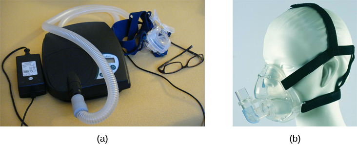
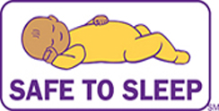

============================
Sleep Problems and Disorders
============================

.. card::

   By the end of this section, you will be able to: 
   
   * Describe the symptoms and treatments of insomnia, especially sleep hygiene. 
   * Recognize the symptoms of several parasomnias
   * Describe the symptoms and treatments for sleep apnea
   * Recognize risk factors associated with sudden infant death syndrome (SIDS) and steps to prevent it. 
   * Describe the symptoms and treatments for narcolepsy

Many people experience disturbances in their sleep at some point in
their lives. Depending on the population and sleep disorder
studied, 30% to 50% population have a sleep disorder at some point in life. :footcite:p:`bixlerPrevalenceofsleepdisorders1979,hossainThePrevalenceCostImplications2002,ohayonPrevalenceDSMIVDiagnostic1997,ohayonMetaAnalysisQuantitativeSleep2004,ohayonPrevalenceofrestlesslegs2002`
This section will describe several sleep disorders as well
as some of their treatment options.

INSOMNIA
========

Insomnia, a consistent difficulty falling or staying asleep, is the
most common of the sleep disorders. Individuals with insomnia often
experience long delays when they go to bed and
fall asleep. In addition, these individuals may wake up several
times during the night only to find difficulty getting
back to sleep. Yet, a subgroup of people
experiences late insomnia or early morning waking. Late Insomnia is characteristic 
of severe or melancholic depression. Insomnia that occurs exclusively 
during the course of depression or another disorder, however, does not qualify the diagnostic 
criteria of insomnia disorder. 

As mentioned earlier, one of the criteria for insomnia
involves experiencing these symptoms for at least three nights a week
for at least one month :footcite:p:`rothInsomniaPrevalenceEtiology2007a`.

It is not uncommon for people suffering from insomnia to experience
**anxiety** about their inability to fall asleep. This
becomes a self-perpetuating cycle because increased anxiety leads to
increased arousal, and higher arousal levels make the prospect of
falling asleep even more unlikely. Chronic insomnia is almost always
associated with feeling overtired and may be associated with symptoms of
depression.

.. note:: 

   Sleep-onset insomnia is more likely due to anxiety, while
   late insomnia is characteristic of severe depression. 

Many factors may contribute to insomnia, including age,
drug use, exercise, mental status, and bedtime routines. Not
surprisingly, insomnia treatment may take one of several different
approaches. People with insomnia might limit their use of
stimulant drugs (such as caffeine) or increase their physical
exercise during the day. Some people might turn to over-the-counter
(OTC) or prescribed sleep medications to help them sleep, but this
should be done sparingly because many sleep medications result in
dependence and alter the nature of the sleep cycle, and they can
increase insomnia over time. Those who continue to have insomnia,
particularly if it affects their quality of life, should seek
professional treatment.

Some forms of psychotherapy, such as cognitive-behavioral therapy, can
help people with insomnia. :term:`Cognitive-behavioral therapy` is a type of psychotherapy 
focusing on cognitive
processes and problem behaviours. The treatment of insomnia likely would
include stress management techniques and changes in problematic
behaviors that could contribute to insomnia (e.g., spending more waking
time in bed). Cognitive-behavioral therapy has been demonstrated to be
quite effective in treating insomnia. :footcite:p:`SavardRandomizedStudyontheEfficacyofCognitive2005,WilliamsCognitiveBehavioralTreatmentofInsomnia2013`

Sleep-hygiene
=============
People who experience insomnia are often prescribed hypnotics. 
In addition to their adverse effects, the therapeutic effects are often temporary 
as tolerance develops quickly. 
Sleep hygiene techniques can eliminate the need for medication use. 
The following are some of the principles of sleep hygiene. The first step 
would be to assess a patient's routines based on these principles to identify 
maladaptive habits and tailor the recommendations accordingly. To raise the patient's 
motivation to use these techniques, they may also be informed about the importance of 
adequate sleep and the adverse effects of long-term sleep deprivation on our mental 
and physical well-being. 

1. Using **consistent sleep-wake schedule** even on weekends or other holidays is important; 
   disturbance in the schedule disrupts our circadian rhythm and may lead to 
   problems such as jet lag.  
2. Exposure to **sunlight** in the day, and keeping **dark at night** also help regulate circadian rythms.
   bright light, especially blue light, inhibits melatonin production, inducing wakefulness. Thus, 
   bright light and devices producing bright light, such as computers, tablets, and smartphones, must be 
   avoided at night. If their use is unavoidable, brightness must be lowered to a minimum 
   , and a blue-light blocking filter should be turned on.
3. Performing **aerobic exercise in the morning** has been shown to improve sleep at night; 
   such a stimulating activity must, however, be avoided in the evening. The resulting sympathetic
   activation may lead to insomnia.
4. **Avoiding day-time naps** should be the goal; if unavoidable, a nap should occur before
   3 PM and last no longer than 30 minutes. 
5. Ideally, **one specific room and bed** must be used for sleep which must **only** be used for sleep. 
   It must not be used for office or school work or other activities that can be performed in 
   another room and in different settings, such as a table and a chair. This is based on the
   principles of classical conditioning. Over time, as the bed is 
   used specifically for sleep, it becomes a conditioned stimulus and elicits sleep. 
6. Foods containing **caffeine**, such as tea, coffee, energy drinks, and cola drinks,
   must be avoided after 4 PM. Similarly, excessive consumption of sweets, 
   smoking cigarette, or using alcohol may impair sleep. **Tryptophan** containing foods,
   such as milk, is encouraged; it is a precursor of serotonin and melatonin and helps with sleep. The quantity 
   of food consumed should be enough to avoid discomfort due to an empty stomach or overeating. A meal
   should be taken at least a couple of hours before bedtime. 
7. For some, **sleep restriction** may be helpful. In this, the patient is enquired about the 
   approximate sleep duration, and their bedtime is restricted only to that much interval. For
   example, suppose a patient usually falls asleep at 1:00 AM after spending several hours in their bed. In that case,
   they must go to bed at around 1 AM and leave immediately upon awakening. 
   This technique is also based on conditioning, as discussed above.
   Gradually, bedtime duration increases as the patient's sleep improve.
8. In **stimulus control**, the patient must avoid going to their bed until they feel drowsy. This interval should be spent sitting in a calm, dark environment and a comfortable chair. Using earbuds with a masking effect can help block noise from a source that can be controlled. White noise machines may also help, especially for those with tinnitus. 
9. Discussing or thinking about distressing or exciting issues can cause sympathetic responses and impair sleep. If issues must be discussed, they should be discussed in the daytime, long before the time for sleep. To avoid preoccupation with intrusive thoughts, the patient is advised to **count backward from 500**. 
10. During bedtime, **room temperature** should be at a level where one would need a light blanket. People more readily fall asleep when the temperature is low or when their body temperature drops. A warm water bath before bedtime can thus help induce sleep. 
11. Repeatedly checking time and actively trying to fall asleep is similarly distressing and prevents one from falling asleep. Instead, the patient is advised to **try to stay awake**. 
12. If anxiety is significant, regular **progressive muscle relaxation** before bedtime will help. 
13. Aromatherapy with lavender oil may also help.

.. admonition:: Sleep Disruption in Depression
   :class: hint
   
   In patients with depression, there is a disturbance of sleep continuity; they spend more
   time awake and have increased sleep fragmentation. Early morning wakening occurs 
   characteristically in severe and melancholic depression. 
   
   Evidence has shown a disturbance in the sleep architecture, with decreased 
   slow-wave sleep on electroencephalography. 
   
   Disturbances in REM sleep include shortened REM latency, more REM activity 
   (higher percentage in the first ½ of the night and a higher REM density. 
   Sleep deprivation (especially deprivation of REM sleep) has shown a temporary but 
   beneficial effect on mood in depressed patients resulting in quick improvement. 
   Antidepressants impair REM sleep - there is a rebound of REM sleep on discontinuation

PARASOMNIAS
===========

:term:`Parasomnias` comprise a group of sleep
disorders in which unwanted, disruptive motor activity or
experiences during sleep play a role. Parasomnias can occur in either
REM or NREM phases of sleep. Sleepwalking, restless leg syndrome, and
night terrors are all examples of parasomnias (Mahowald & Schenck,
2000).

Sleepwalking
------------

In :term:`sleepwalking`, or somnambulism, the sleeper
engages in relatively complex behaviors ranging from wandering about to
driving an automobile. During a sleepwalking episode, sleepers often
have their eyes open but are not responsive to attempts to
communicate with them. Sleepwalking most often occurs during slow-wave
sleep, but it can occur at any time during a sleep period in some
affected individuals. :footcite:p:`mahowaldDiagnosisandmanagement2000`

Historically, somnambulism has been treated with various
pharmacotherapies ranging from benzodiazepines to antidepressants.
However, the success rate of such treatments is questionable.
Guilleminault et al. (2005) :footcite:p:`guilleminaultAdultChronicSleepwalking2005` 
found that sleepwalking was not alleviated
with benzodiazepines. However, all of their somnambulistic
patients who also suffered from sleep-related breathing problems showed
a marked decrease in sleepwalking when their breathing problems were
effectively treated.

Environmental Approaches to Manage Sleepwalking
--------------------------------------------
The aim of these is mainly to prevent harm and, if possible, prevent
the episodes from occurring.

#. Reassure parents about its benign nature. 
#. Identify and avoid precipitating factors 
#. Avoid waking the patient up during the episode. 
#. Remove obstructions in the bedroom and items on which they may stumble and fall. 
#. Secure windows and cover windows with heavy curtains. 
#. Install locks or alarms on outside doors
#. Use a nightlight in case 
#. Sleep on the ground floor and place barriers in stairways so to prevent them from the rooftop
#. Scheduled awakenings (15-30 minutes prior) may be helpful if the episodes occur consistently at roughly the same time. 

.. admonition:: Clinical Correlate: Sleepwalking Court Defense?
   :class: tip 

   On January 16, 1997, Scott Falater sat down to dinner with his wife
   and children and told them about difficulties he was experiencing on
   a project at work. After dinner, he prepared some materials to lead 
   a church youth group the following morning. Then he
   attempted to repair the family’s swimming pool pump before retiring to
   bed. The following morning, he awoke to barking dogs and unfamiliar
   voices from downstairs. As he went to investigate what was going on,
   he was met by a group of police officers who arrested him for the
   murder of his wife :footcite:p:`cartwrightSleepwalkingViolenceSleep2004` (Cartwright, 2004; CNN, 1999).

   Yarmila Falater’s body was found in the family’s pool with 44 stab
   wounds. A neighbor called the police after witnessing Falater
   standing over his wife’s body before dragging her into the pool. Upon
   a search of the premises, police found blood-stained clothes and a
   bloody knife in the trunk of Falater’s car, and he had blood stains
   on his neck.

   Remarkably, Falater insisted that he had no recollection of hurting
   his wife in any way. His children and his wife’s parents all agreed
   that Falater had an excellent relationship with his wife, and they
   could not think of a reason that would provide any motive to
   murder her. :footcite:p:`cartwrightSleepwalkingViolenceSleep2004`

   Scott Falater had a history of regular episodes of sleepwalking as a
   child and he had even behaved violently toward his sister once when
   she tried to prevent him from leaving their home in his pajamas
   during a sleepwalking episode. He suffered from no apparent
   anatomical brain anomalies or psychological disorders. It appeared
   that Scott Falater had killed his wife in his sleep, or at least,
   that is the defense he used when he was trialed for his wife’s murder
   (Cartwright, 2004; CNN, 1999). In Falater’s case, a jury found him
   guilty of first-degree murder in June of 1999 (CNN, 1999); however,
   there are other murder cases where the sleepwalking defense has been
   used successfully. As scary as it sounds, many sleep researchers
   believe that homicidal sleepwalking is possible in individuals
   suffering from the types of sleep disorders described below
   (Broughton et al., 1994; Cartwright, 2004; Mahowald, Schenck, &
   Cramer Bornemann, 2005; Pressman, 2007).

REM Sleep Behavior Disorder (RBD)
---------------------------------

:term:`REM sleep behavior disorder (RBD)` occurs when
the muscle paralysis associated with the REM sleep phase does not occur.
Individuals who suffer from RBD have high physical activity levels
during REM sleep, especially during disturbing dreams. These behaviors
vary widely, including kicking, punching, scratching,
yelling, and behaving like an animal that has been frightened or
attacked. People who suffer from this disorder can injure themselves or
their sleeping partners when engaging in these behaviors. Furthermore,
these types of behaviors ultimately disrupt sleep, although affected
individuals have no memories that these behaviors have occurred. :footcite:p:`arnulfREMsleepbehavior2012`

This disorder is associated with several neurodegenerative diseases, such as Parkinson’s. 
This relationship is so robust that some view the presence of RBD as a potential aid in diagnosing and treating several neurodegenerative 
diseases. :footcite:p:`ferini-strambiDoesIdiopathicREM2011` 
Clonazepam, an anti-anxiety medication with sedative properties,
is most often used to treat RBD. It is administered alone or in
conjunction with doses of melatonin (the hormone secreted by the pineal
gland). As part of treatment, the sleeping environment is often modified
to make it safer for those suffering from RBD. :footcite:p:`zanigniREMBehaviourDisorder2011`

Other Parasomnias
-----------------

A person with :term:`restless leg syndrome` has
uncomfortable sensations in the legs during periods of inactivity or
when trying to fall asleep. This discomfort is relieved by deliberately
moving the legs, which, not surprisingly, contributes to difficulty in
falling or staying asleep. Restless leg syndrome is quite common and has
been associated with several other medical diagnoses, such as
**chronic kidney disease** and **diabetes** :footcite:p:`mahowaldSleeprelatedViolence2005` (Mahowald & Schenck, 2000). 
There are a variety of drugs that treat restless leg syndrome:
benzodiazepines, opiates, and anticonvulsants (Restless Legs Syndrome
Foundation, n.d.).

:term:`Night terrors` present as a panic in
the sufferer and are often accompanied by screams and attempts to escape
from the immediate environment (Mahowald & Schenck, 2000). Although
individuals suffering from night terrors appear to be awake, they
generally have no memories of the events, and attempts to
console them are ineffective. Typically, individuals suffering from
night terrors will fall back asleep again within a short time. Night
terrors occur during the NREM phase of sleep (Provini,
Tinuper, Bisulli, & Lagaresi, 2011). Generally, treatment for night
terrors is unnecessary unless there is some underlying medical or
psychological condition that is contributing to the night terrors (Mayo
Clinic, n.d.).

SLEEP APNOEA
============

:term:`Sleep apnea` is defined by episodes during
which a sleeper’s breathing stops. These episodes can last 10–20 seconds
or longer and often are associated with brief periods of arousal. 
While individuals suffering from sleep apnea may not be aware of these
repeated sleep disruptions, they experience increased fatigue levels. 
Many individuals diagnosed with sleep apnea first seek
treatment because their sleeping partners indicate that they snore
loudly and stop breathing for extended periods while sleeping. :footcite:p:`henryListeningHisBreath2013` 

.. admonition:: Presentation of Sleep Apnoea
   :class: attention

   Individuals with sleep apnoea are unaware of their sleep disruptions. 
   Fatigue, excessive daytime sleepiness, and, if a partner has obersved, snoring are
   important indicators. 
   

Sleep apnea is much more common among obese 
people and is often associated with loud snoring. Surprisingly, sleep
apnea may exacerbate cardiovascular disease. :footcite:p:`sanchez-de-la-torreObstructiveSleepApnoea2013` 
While sleep apnea is less common in
thin people, a person who snores loudly or gasps for air should be 
evaluated for sleep apnea regardless of weight.

While people are often unaware of their sleep apnea, they are keenly
aware of some of the adverse consequences of insufficient sleep.
Consider a patient who believed that as a result of his sleep apnea, he:

.. epigraph::
   
   “had three car accidents in six weeks. They were ALL my fault. Two of
   them I did not even know I was involved in until afterward.” 
   
      -- Henry & Rosenthal, 2013, p. 52. 

It is not uncommon for people suffering from
undiagnosed or untreated sleep apnea to fear that their careers will be
affected by the lack of sleep, illustrated by this statement from
another patient, 

.. epigraph::
   
   “I am in a job where there is a premium on being mentally
   alert. I was sleepy… and having trouble concentrating…. It was
   getting to the point where it was kind of scary” 
      
       -- Henry & Rosenthal, 2013, p. 52 :footcite:p:`henryListeningHisBreath2013`

The following are the clinical features of sleep apnoea: 

#. Loud snoring (95%)
#. Daytime sleepiness (90%)
#. Unrefreshed or disturbed sleep
#. Morning headache and confusion
#. Nocturnal choking
#. Enuresis
#. Swelling of the ankles

There are two types of sleep apnea: **obstructive** sleep apnea and **central**
sleep apnea. :term:`Obstructive sleep apnea` occurs
when an individual’s airway becomes blocked during sleep, and the air is
prevented from entering the lungs. In :term:`central sleep apnea`, 
disruption in signals sent from the brain that
regulate breathing cause periods of interrupted breathing (White, 2005).

One of the most common sleep apnea treatments involves using 
:term:`continuous positive airway pressure (CPAP)` device. It includes 
a mask that fits over the
sleeper’s nose and mouth, which is connected to a pump that pumps air
into the person’s airways, forcing them to remain open, as shown in
`[fig] <#Figure_04_04_CPAP>`__. Some newer CPAP masks are smaller and
cover only the nose. This treatment option has proven effective
for people suffering from mild to severe cases of sleep apnea. :footcite:p:`mcdaidSystematicReviewContinuous2009`
However, alternative treatment options are being explored
because consistent compliance by users of CPAP devices is a problem.
Recently, a new **EPAP (expiratory positive air pressure)** device has shown
promise in double-blind trials as one su.ch alternative. :footcite:p:`berryNovelNasalExpiratory2011`

   Photograph A shows a CPAP device. Photograph B shows a clear full-face CPAP
   mask attached to a mannequin's head with straps

SIDS
----

In :term:`sudden infant death syndrome (SIDS)` an
infant stops breathing during sleep and dies. Infants younger than 12
months appear to be at the highest risk for SIDS, and boys have a
greater risk than girls. Several risk factors have been associated
with SIDS including premature birth, smoking within the home, and
hyperthermia. There may also be differences in both brain structure and
function in infants that die from SIDS :footcite:p:`berkowitzSuddenInfantDeath2012,mageFemaleResistanceHypoxia2006` (Thach, 2005).

.. admonition:: Preventing SIDS
   :class: tip 

   The substantial amount of research on SIDS has led to several
   recommendations to parents to protect their children
   (`[link] <#Figure_04_04_SIDS>`__). For one, research suggests that:
   
   #. Infants should be placed on their backs when put down to sleep, and
   #. Their cribs should not contain items that pose suffocation threats, such as blankets, pillows or padded crib bumpers (cushions that cover the crib bars). 
   #. Infants should not have caps placed on their heads when put down to sleep in order to prevent overheating, and 
   #. People in the child’s household should abstain from smoking in the home.
   
   Recommendations like these have helped to decrease the number of infant deaths
   from SIDS in recent years :footcite:p:`mitchellSIDSPresentFuture2009,moonSIDSOtherSleepRelated2011`
   

   
   The “Safe to Sleep” campaign logo shows a baby sleeping and the words
   “safe to sleep.”

   Safe to Sleep campaign started in 1994 as Back to Sleep to teach people 
   about reducing the risk of SIDS. 

NARCOLEPSY
==========

Unlike the other sleep disorders described in this section, a person
with :term:`narcolepsy` cannot resist falling asleep
at inopportune times. These sleep episodes are often associated with
:term:`cataplexy`, a lack of muscle tone or
muscle weakness, and in some cases involve, complete paralysis of the
voluntary muscles. This is similar to the kind of paralysis experienced
by healthy individuals during 
REM sleep. :footcite:p:`burgessNarcolepsyNeuralMechanisms2012,hishikawaPhysiologyofREMsleep1995,luppiNeuronalNetworkResponsible2011`
Narcoleptic episodes
take on other features of REM sleep. For example, around one-third of
individuals diagnosed with narcolepsy experience vivid, dream-like
hallucinations during narcoleptic attacks. :footcite:p:`chokrovertyOverviewSleep1994`

Surprisingly, narcoleptic episodes are often triggered by states of
heightened arousal or stress. The typical episode can last from a minute
or two to half an hour. Once awakened from a narcoleptic attack, people
report that they feel refreshed. :footcite:p:`ChokrovertyAnOverviewofNormalSleep2013` 
Obviously, regular
narcoleptic episodes could interfere with the ability to perform one’s
job or complete schoolwork, and in some situations, narcolepsy can
result in significant harm and injury (e.g., driving a car or operating
machinery or other potentially dangerous equipment).

Generally, narcolepsy is treated using psychomotor stimulant drugs, such
as amphetamines. :footcite:p:`mignotAPracticalGuidetothe2012`
These drugs promote increased levels of
neural activity. Narcolepsy is associated with reduced levels of the
signaling molecule hypocretin in some areas of the brain (De la
Herrán-Arita & Drucker-Colín, 2012; Han, 2012), and the traditional
stimulant drugs do not directly affect this system. Therefore, it
is quite likely that new medications that are developed to treat
narcolepsy will be designed to target the hypocretin system.

There is tremendous variability among sufferers regarding how symptoms of 
narcolepsy manifest and the effectiveness of
currently available treatment options. This is illustrated by McCarty’s
(2010) case study of a 50-year-old woman who sought help for the
excessive sleepiness during regular waking hours that she had experienced
for several years. She indicated that she had fallen asleep at
inappropriate or dangerous times, including eating,
socializing with friends, and driving her car. During periods of
emotional arousal, the woman complained that she felt some weakness in
the right side of her body. Although she did not experience any
dream-like hallucinations, she was diagnosed with narcolepsy due to sleep testing. 
The fact that her cataplexy occurred solely
on the right side of her body was quite unusual. Early attempts to treat
her condition with a stimulant drug alone were unsuccessful. However,
her condition improved dramatically with a combination of a stimulant drug 
and an antidepressant.

Excessive Daytime Sleepiness
~~~~~~~~~~~~~~~~~~~~~~~~~~~~
Excessive daytime sleepiness (EDS) may occur due to primary hypersomnia, 
sleep deprivation, or sleep disorder. The following is a summary of common 
causes of EDS. 

Aetiology
^^^^^^^^^

1. Insufficient night-time sleep
   a. Unsatisfactory irregular sleep routines
   b. Circadian rhythm sleep disorders
   c. Frequent parasomnias
   d. Chronic physical illness
   e. Psychiatric disorders
2. Pathological sleep
   a. Obstructive sleep apnoea
   b. Narcolepsy
   c. Other CNS disease
   d. Drug effects
   e. Kleine-Levin syndrome
   f. Atypical depressive illness

**Epworth Sleepiness Scale (ESS)** is a self-rated scale used by clinicians 
to assess daytime sleepiness. 
The scale contains a total of 8 items, and each scored 0-3. From a total score 
of 24, 11 suggest some degree of daytime sleepiness, while  16 suggest 
excessive daytime sleepiness. 

Psychiatric Disorders and Sleep Architecture
--------------------------------------------

#. Depression
    #. reduced duration of stages 3 and 4
    #. reduced REM latency
    #. REM occurs earlier in the night
#. Schizophrenia
    #. reduced slow-wave sleep
    #. reduced REM
#. Anxiety
    #. increased duration of stages 1 and 2
    #. reduced efficacy of sleep
#. Panic disorder
    #. increased sleep latency
#. Alcoholism
    #. increased delta
    #. increased REM sleep
    #. increased alpha activity
#. Alzheimer’s disease
    #. increased sleep
    #. fragmentation
    #. reduced sleep efficiency

The Effects of Drugs on Sleep
-----------------------------
**Alcohol** has a biphasic action on sleep. In the first half of the night, 
it decreases sleep onset latency (promotes sleep initially). 
Regarding sleep architecture, it leads to an increase in the duration of deep sleep and 
relative deprivation of REM sleep. 
In the night's second half, there is a rebound increase in REM sleep duration.  
The sleep promotion associated with small doses of alcohol may be related to prior 
sleep deprivation. 
Alcohol also exacerbates sleep-related breathing disorders, sleep apnoea, and sleepwalking. 
Chronic use of excessive amounts of alcohol disrupts all stages of sleep. During withdrawal, the total sleep time is reduced and 
non-REM sleep is particularly affected. 

+-------------+-------------+-------------+-------------+-------------+
| Drug        | Total Sleep | REM         | Light sleep | Deep sleep  |
|             | time        |             | Stages 1 &  | Stages 3 &  |
|             |             |             | 2           | 4           |
+=============+=============+=============+=============+=============+
| *Opioids*   | ↓           | ↓           | ↓           | ↓           |
+-------------+-------------+-------------+-------------+-------------+
| *Caffeine*  | ↓           | ↓ REM       |             | slightly ↓  |
|             |             | latency     |             |             |
|             |             |             |             |             |
|             |             | ↑ REM sleep |             |             |
+-------------+-------------+-------------+-------------+-------------+
| *Am         | initial     | ↑ REM       |             |             |
| phetamines, | insomnia    | latency     |             |             |
| cocaine*    | and reduced |             |             |             |
|             | TST         | ↓ REM sleep |             |             |
+-------------+-------------+-------------+-------------+-------------+

Summary
=======

Many individuals suffer from some sleep disorder or disturbance
at some point. Insomnia is a common experience in which
people have difficulty falling or staying asleep. Parasomnias involve
unwanted motor behavior or experiences throughout the sleep cycle, 
including RBD, sleepwalking, restless leg syndrome, and night terrors.
Sleep apnea occurs when individuals stop breathing during sleep; in 
the case of sudden infant death syndrome, infants will stop
breathing during sleep and die. Narcolepsy involves an irresistible urge
to fall asleep during waking hours and is often associated with
cataplexy and hallucination.

.. card-carousel:: 1
   
   .. card:: Question

      The loss of muscle tone or control that is often
      associated with narcolepsy:

      1. RBD
      2. CPAP
      3. cataplexy
      4. insomnia

    .. dropdown:: Check Answer

      C
  .. Card:: Question

      An individual may suffer from \_______\_ if there is a disruption
      in the brain signals that are sent to the muscles that regulate
      breathing.

      1. central sleep apnea
      2. obstructive sleep apnea
      3. narcolepsy
      4. SIDS

    .. dropdown:: Check Answer

       A
  .. Card:: Question

      The most common treatment for \_______\_ involves the use of
      amphetamine-like medications.

      1. sleep apnea
      2. RBD
      3. SIDS
      4. narcolepsy

    .. dropdown:: Check Answer

       D
  .. Card:: Question

      \_______\_ is another word for sleepwalking.

      1. insomnia
      2. somnambulism
      3. cataplexy
      4. narcolepsy

    .. dropdown::

      B

Critical Thinking Questions
===========================

.. card::

   .. card::

      One of the recommendations that therapists will make to people with 
      insomnia is to spend less waking time in bed. Why do you 
      think spending waking time in bed might interfere with the
      ability to fall asleep later?

   .. dropdown::

      Answers will vary. One possible explanation might invoke
      principles of associative learning. If the bed represents a place
      for socializing, studying, eating, and so on, then it is possible
      that it will become a place that elicits higher levels of arousal,
      which would make falling asleep at the appropriate time more
      difficult. Answers could also consider a self-perpetuating cycle
      referred to when describing insomnia. If an individual is having
      trouble falling asleep and that generates anxiety, it might make
      sense to remove him from the context where sleep would normally
      take place to try to avoid anxiety being associated with that
      context.

.. card::

   .. card::

      How is narcolepsy with cataplexy similar to and different from REM
      sleep?

   .. dropdown::

      Similarities include muscle atony and the hypnagogic
      hallucinations associated with narcoleptic episodes. The
      differences involve the uncontrollable nature of narcoleptic
      attacks and the fact that these come on in situations that would
      typically not be associated with sleep of any kind (e.g., instances
      of heightened arousal or emotionality).

Personal Application Question
=============================

.. card::

   .. card::
      
      What factors might contribute to your own experiences with insomnia?

Glossary
========

.. glossary::

   cataplexy
      lack of muscle tone or muscle weakness, and in some cases, complete
      paralysis of the voluntary muscles

   central sleep apnea
      sleep disorder with periods of interrupted breathing due to a
      disruption in signals sent from the brain that regulate breathing
      ^

   cognitive-behavioral therapy
      psychotherapy that focuses on cognitive processes and problem
      behaviors that is sometimes used to treat sleep disorders such as
      insomnia 

   continuous positive airway pressure (CPAP)
      device used to treat sleep apnea; includes a mask that fits over
      the sleeper’s nose and mouth, which is connected to a pump that
      pumps air into the person’s airways, forcing them to remain open ^

   narcolepsy
      sleep disorder in which the sufferer cannot resist falling to
      sleep at inopportune times ^

   night terror
      sleep disorder in which the sleeper experiences a sense of panic
      and may scream or attempt to escape from the immediate environment
   

   obstructive sleep apnea
      sleep disorder defined by episodes when breathing stops during
      sleep as a result of blockage of the airway ^

   parinsomnia
      one of a group of sleep disorders characterized by unwanted,
      disruptive motor activity and/or experiences during sleep ^

   REM sleep behavior disorder (RBD)
      sleep disorder in which the muscle paralysis associated with the
      REM sleep phase does not occur; sleepers have high levels of
      physical activity during REM sleep, especially during disturbing
      dreams ^

   restless leg syndrome
      sleep disorder in which the sufferer has uncomfortable sensations
      in the legs when trying to fall asleep that are relieved by moving
      the legs ^

   sleep apnea
      sleep disorder defined by episodes during which breathing stops
      during sleep ^

   sleepwalking
      (also, somnambulism) sleep disorder in which the sleeper engages
      in relatively complex behaviors

   sudden infant death syndrome (SIDS)
      infant (one year old or younger) with no apparent medical
      condition suddenly dies during sleep

References
-----------
  .. footbibliography::

