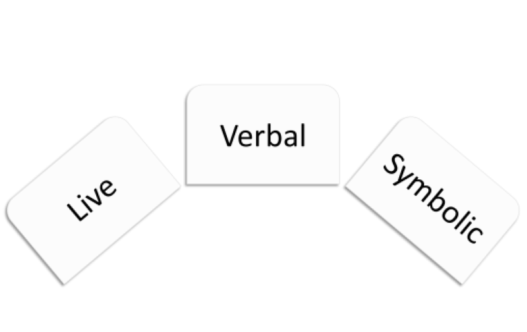

=================================
Observational Learning (Modelling)
=================================

.. meta::
   
   :title: Observational learning
   :author: Justpsychiatry
   :description: This section covers Observational learning. 
   :keywords: observational learning, vicarious reinforcement, social learning theory, vicarious punishment, 
   

.. card:: Learning Objectives

   By the end of this section, you will be able to: 
   
   * Define observational learning
   * Discuss the steps in the Modelling process
   * Explain the prosocial and antisocial effects of observational learning

Previous sections of this chapter focused on classical and operant
conditioning, which are forms of associative learning. In
:term:`observational learning`, we learn by watching
others and then imitating, or Modelling, what they do or say. The
individuals performing the imitated behaviour are called :term:`models`.
Research suggests that this imitative learning
involves a specific type of neuron, called a **mirror neuron** :footcite:p:`hickokRoleMirrorNeurons2010,rizzolattiMirrorNeuronsImitation2002,rizzolattiMirrorsMind2006`.

Humans and other animals are capable of observational learning. As you
will see, the phrase "*monkey see, monkey do*" really is accurate
(`[link] <#Figure06_04_Monkey>`__). The same could be said about other
animals. For example, in a study of social learning in chimpanzees,
researchers gave juice boxes with straws to two groups of captive
chimpanzees. The first group dipped the straw into the juice box, and
then sucked on the small amount of juice at the end of the straw. The
second group sucked through the straw directly, getting much more juice.
When the first group, "the  **dippers**,” observed the second group, “the
**suckers**,” what do you think happened? All of the “dippers” in the first
group switched to sucking through the straws directly. By simply
observing the other chimps and Modelling their behaviour, they learned
that this was a more efficient method of getting juice :footcite:p:`yamamotoBasisCumulativeCultural2013`.

   A photograph shows a person drinking from a water bottle, and a monkey
   next to the person drinking water from a bottle in the same manner. 

Imitation
---------

Imitation is much more obvious in humans, but is :term:`imitation` 
really the sincerest form of flattery?
Consider Claire’s experience with observational learning. Claire’s
nine-year-old son, Jay, was getting into trouble at school and was
defiant at home. Claire feared that Jay would end up like her brothers,
two of whom were in prison. One day, after yet another bad day at school
and another negative note from the teacher, Claire, at her wit’s end,
beat her son with a belt to get him to behave. Later that night, as she
put her children to bed, Claire witnessed her four-year-old daughter,
Anna, take a belt to her teddy bear and whip it. Claire was horrified,
realizing that Anna was imitating her mother. It was then that Claire
knew she wanted to discipline her children in a different manner.

Cognitive Factors
-----------------

Like Tolman, whose experiments with rats suggested a cognitive component
to learning, psychologist Albert Bandura’s ideas about learning were
different from those of strict behaviourists. Bandura and other
researchers proposed a brand of behaviourism called **social learning theory**, 
which took cognitive processes into account. According to
:term:`Bandura`, pure behaviourism could
not explain why learning can take place in the absence of external
reinforcement. He felt that internal mental states must also have a role
in learning and that observational learning involves much more than
imitation. In imitation, a person simply copies what the model does.
Observational learning is much more complex. According to Lefrançois
(2012)  there are several ways that observational learning can occur:

1. You learn a new response. After watching your coworker get chewed out
   by your boss for coming in late, you start leaving home 10 minutes
   earlier so that you won’t be late.
2. You choose whether or not to imitate the model depending on what you
   saw happen to the model. Remember Julian and his father? When
   learning to surf, Julian might watch how his father pops up
   successfully on his surfboard and then attempt to do the same thing.
   On the other hand, Julian might learn not to touch a hot stove after
   watching his father get burned on a stove.
3. You learn a general rule that you can apply to other situations. 

Types of Models: Live, verbal and symbolic
-------------------------------------------

Bandura identified three kinds of models: live, verbal, and symbolic. 

1. A **live model** demonstrates a behaviour in person, as when Ben stood up on his surfboard so that Julian could see how he did it. 
2. A **verbal instructional model** does not perform the behaviour, but instead explains or describes the behaviour, as when a soccer coach tells his young players to kick the ball with the side of the foot, not with the toe. 
3. A **symbolic model** can be fictional characters or real people who demonstrate behaviors in books, movies, television shows, video games, or Internet sources (`[link] <#Figure06_04_Yoga>`__).

  
   Three types of Models according to Bandura. 

   Photograph A shows a yoga instructor demonstrating a yoga pose while a 
   group of students observes her and copies the pose. Photo B shows a
   child watching television.

.. seealso::

   Latent learning and Modelling are used all the time in the world of
   marketing and advertising. `This
   commercial <https://youtu.be/5j5Xr1t6DJc>`__ played for months across
   the New York, New Jersey, and Connecticut areas, Derek Jeter, an
   award-winning baseball player for the New York Yankees, is
   advertising a Ford. The commercial aired in a part of the country
   where Jeter is an incredibly well-known athlete. He is wealthy, and
   considered very loyal and good looking. What message are the
   advertisers sending by having him featured in the ad? How effective
   do you think it is?

Steps In The Modelling Process
==============================

Of course, we don’t learn a behaviour simply by observing a model.
Bandura described specific steps in the process of Modelling that must be
followed if learning is to be successful: attention, retention,
reproduction, and motivation: 

1. First, you must be focused on what the model is doing—you have to pay **attention**. 
2. Next, you must be able to retain, or remember, what you observed; this is **retention**. 
3. Then, you must be able to perform the behaviour that you observed and committed to memory; this is **reproduction**. 
4. Finally, you must have **motivation**. 
   
Vicarious reinforcement
-----------------------

You need to want to copy the behaviour, and whether or not you are motivated
depends on what happened to the model. If you saw that the model was
reinforced for her behaviour, you will be more motivated to copy her.
This is known as :term:`vicarious reinforcement`. 

Vicarious punishment
--------------------
On the other hand, if you observed the model being punished, you would be
less motivated to copy her. This is called :term:`vicarious punishment`. 
For example, imagine that four-year-old Allison
watched her older sister Kaitlyn playing in their mother’s makeup, and
then saw Kaitlyn get a time out when their mother came in. After their
mother left the room, Allison was tempted to play in the make-up, but
she did not want to get a time-out from her mother. What do you think
she did? Once you actually demonstrate the new behaviour, the
reinforcement you receive plays a part in whether or not you will repeat
the behaviour.

Modelling of aggression and violence
------------------------------------

Bandura researched Modelling behaviour, particularly children’s Modelling
of adults’ aggressive and violent 
behaviors :footcite:p:`banduraTransmissionAggressionImitation1961`. 
He conducted an experiment with a five-foot inflatable doll that
he called a **Bobo doll**. In the experiment, children’s aggressive behaviour
was influenced by whether the teacher was punished for her behaviour. In
one scenario, a teacher acted aggressively with the doll, hitting,
throwing, and even punching the doll, while a child watched. There were
two types of responses by the children to the teacher’s behaviour. When
the teacher was punished for her bad behaviour, the children decreased
their tendency to act as she had. When the teacher was praised or
ignored (and not punished for her behaviour), the children imitated what
she did, and even what she said. They punched, kicked, and yelled at the
doll.

.. seealso::

   Watch this `video clip <http://openstax.org/l/bobodoll>`__ to see a
   portion of the famous Bobo doll experiment, including an interview
   with Albert Bandura.

Implications
============

What are the implications of this study? Bandura concluded that we watch
and learn, and that this learning can have both :term:`prosocial`
and :term:`antisocial` effects. 

Prosocial effects
-----------------

Prosocial (positive) models can be used to
encourage socially acceptable behaviour. Parents in particular should
take note of this finding. If you want your children to read, then read
to them. Let them see you reading. Keep books in your home. Talk about
your favourite books. If you want your children to be healthy, then let
them see you eat right and exercise, and spend time engaging in physical
fitness activities together. The same holds true for qualities like
kindness, courtesy, and honesty. The main idea is that children observe
and learn from their parents, even their parents’ morals, so be
consistent and toss out the old adage “Do as I say, not as I do,”
because children tend to copy what you do instead of what you say.
Besides parents, many public figures, such as Martin Luther King,
Jr. and Mahatma Gandhi, are viewed as prosocial models who are able to
inspire global social change. Can you think of someone who has been a
prosocial model in your life?

.. admonition:: Clinical Correlate: Modelling in Therapy
   :class: hint

   Modelling is part of exposure technique. Before the patient enters a feared situation,
   the therapist models the act while the patient is observing. The patient vicariously 
   learns that the therapist does not experience negative outcome upon entering the situation. 

Antisocial Effects
------------------
The antisocial effects of observational learning are also worth
mentioning. As you saw from the example of Claire at the beginning of
this section, her daughter viewed Claire’s aggressive behaviour and
copied it. Research suggests that this may help to explain why abused
children often grow up to be abusers themselves :footcite:p:`murrellCharacteristicsDomesticViolence2007`. 

.. admonition:: Clinical Correlate:  Child abuse 
   :class: attention

   Children who experience abuse during childhood tend to 
   be perpetrators of abuse themselves, as adults. Physical abuse during
   childhood is a risk factor for conduct disorder and antisocial personality disorder. 
   The underlying mechanism is observational learning. 
   In fact, about 30% of abused children become abusive
   parents (U.S. Department of Health & Human Services, 2013). We tend to
   do what we know. Abused children, who grow up witnessing their parents
   deal with anger and frustration through violent and aggressive acts,
   often learn to behave in that manner themselves. Sadly, it’s a vicious
   cycle that’s difficult to break.

.. warning::
   Children learn by observing adults. 

Media Violence Controversy
==========================

Some studies suggest that violent television shows, movies, and video
games may also have antisocial effects
(`[link] <#Figure06_04_Videogames>`__) although further research needs
to be done to understand the correlational and causal aspects of
media violence and behaviour. Some studies have found a link between
viewing violence and aggression seen in children :footcite:p:`andersonMediaViolenceAggression2008, millerAssociationsCommunityViolence2012` (Kirsch, 2010). 
These findings may not be surprising, given that a child
graduating from high school has been exposed to around 200,000 violent
acts including murder, robbery, torture, bombings, beatings, and rape
through various forms of media :footcite:p:`marcBigWorldSmall1993`. Not only might
viewing media violence affect aggressive behaviour by teaching people to
act that way in real life situations, but it has also been suggested
that repeated exposure to violent acts also desensitizes people to it.
While researchers are working to understand this dilemma, the more serious
concern with video games is addiction. Based on evidence, addiction to games is now recognised by the
World Health Organization as clinical condition; it is classified under impulse-control disorders in the ICD-11.

   A photograph shows two children playing a video game and pointing a
   gun-like object toward a screen

.. seealso::

   View this `video <http://openstax.org/l/videogamevio>`__ to hear Brad
   Bushman, a psychologist who has published extensively on human
   aggression and violence, discuss his research.

Summary
=======

According to Bandura, learning can occur by watching others and then
Modelling what they do or say. This is known as observational learning.
There are specific steps in the process of Modelling that must be
followed if learning is to be successful. These steps include attention,
retention, reproduction, and motivation. Through Modelling, Bandura has
shown that children learn many things both good and bad simply by
watching their parents, siblings, and others.

.. card-carousel:: 1

  .. card:: Question

      The person who performs a behavior that serves as an example is
      called a \________.

      1. teacher
      2. model
      3. instructor
      4. coach 

    .. dropdown:: Check Answer

       B
  .. Card:: Question

      In Bandura’s Bobo doll study, when the children who watched the
      aggressive model were placed in a room with the doll and other
      toys, they \________.

      1. ignored the doll
      2. played nicely with the doll
      3. played with tinker toys
      4. kicked and threw the doll 

    .. dropdown:: Check Answer

       D
  .. Card:: Question

      Which is the correct order of steps in the Modelling process?

      1. attention, retention, reproduction, motivation
      2. motivation, attention, reproduction, retention
      3. attention, motivation, retention, reproduction
      4. motivation, attention, retention, reproduction 

    .. dropdown:: Check Answer

       A
  .. Card:: Question

      Who proposed observational learning?

      1. Ivan Pavlov
      2. John Watson
      3. Albert Bandura
      4. B. F. Skinner 

    .. dropdown:: Check Answer

       C

Critical Thinking Questions
===========================

.. card::

   .. card::

      What is the effect of prosocial Modelling and antisocial Modelling?

   .. dropdown::

      Prosocial Modelling can prompt others to engage in helpful and
      healthy behaviors, while antisocial Modelling can prompt others to
      engage in violent, aggressive, and unhealthy behaviors.

.. card::

   .. card::

      Cara is 17 years old. Cara’s mother and father both drink alcohol
      every night. They tell Cara that drinking is bad and she shouldn’t
      do it. Cara goes to a party where beer is being served. What do
      you think Cara will do? Why?

   .. dropdown::

      Cara is more likely to drink at the party because she has observed
      her parents drinking regularly. Children tend to follow what a
      parent does rather than what they say.

Personal Application Questions
==============================

.. card:: Personal Application Questions
   :shadow: md

   .. hint::

      What is something you have learned how to do after watching someone else?

.. glossary::

   model
      person who performs a behavior that serves as an example (in observational learning) ^

   observational learning
      type of learning that occurs by watching others ^

   vicarious punishment
      process where the observer sees the model punished, making the
      observer less likely to imitate the model’s behavior ^

   vicarious reinforcement
      process where the observer sees the model rewarded, making the observer more likely to imitate the model’s behavior

References
-----------

  .. footbibliography::

.. |A photograph shows a person drinking from a water bottle, and a monkey next to the person drinking water from a bottle in the same manner.| image:: ../resources/CNX_Psych_06_04_Monkey.jpg
.. |Photograph A shows a yoga instructor demonstrating a yoga pose while a group of students observes her and copies the pose. Photo B shows a child watching television.| image:: ../resources/CNX_Psych_06_04_Yoga.jpg

