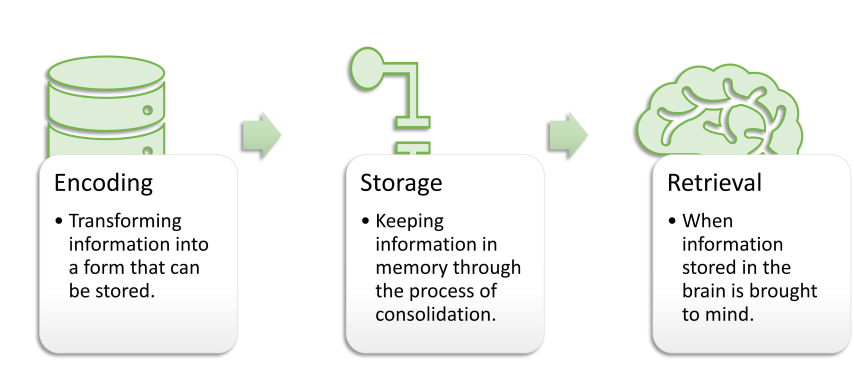
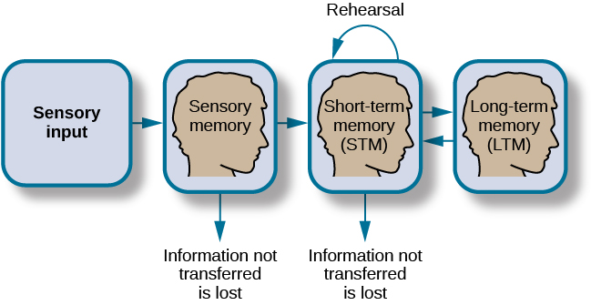
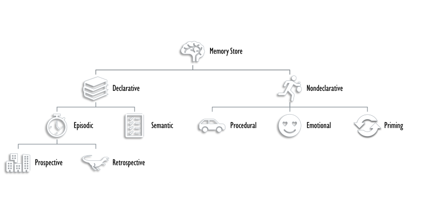

How Memory Functions
####################

.. meta::
   
   :title: How Memory Functions
   :author: Waleed Ahmad
   :description: This chapter covers the various processess and systems of memory 
   :keywords: memory, types of memory, memory models, process of memory.

.. article-info::
    :avatar: jpsy.png
    :avatar-link: https://psychology.mrcpsych.uk/
    :avatar-outline: muted
    :author: Waleed Ahmad
    :date: |today|
    :read-time: 32 min read
    :class-container: sd-p-2 sd-outline-muted sd-rounded-1

.. card:: Learning Objectives
   :class-card: sd-rounded-2
   :shadow: lg

   By the end of this section, you will be able to: 

   * Discuss the three basic functions of memory 
   * Describe the three stages of memory storage 
   * Describe and distinguish between procedural and declarative memory and semantic and episodic memory

...

One of the major elements that separate humans from animals is our ability to store, recall, and use complex information: memory.
Memory refers to the formation, retention, and retrieval of learned associations, stored information, and skills. 

Models of memory 
*****************

Several models of memory have been proposed to describe the various systems, processes 
and subtypes of memory. 

**Broadbent's Model** (1958) describes three memory storing systems, S-system for sensory memory, 
P-system for short-term memories and and a long-term store.

**Atkinson and Shriffen's Model** 1968, also known as multi-store model or 
modal model of memory, also describes such three systems 
respectively termed, sensory memory, 
short-term memory and long-term memory stores; the model also described an executive control process
that controlled the flow of information between these stores. 

These two models deal largely with **memory storage systems** classifed based on the duration 
they can store information and their maximum storage capacity but do not describe the processing
of information, such as how information is encoded, manipulated, elaborated or retrived from these
stores. 

The processing of memory is broadly 
described by the **information processing model**.  Information processing models involve
an **input** system to receive information, a **central processing system** that receives information
from the input system, processess it and passess the final product to on to an **output** system, such as our longterm 
memory system, which stores this information for later recall.  

The **levels of processing theory** and **Baddely's model** are 
information processing models, as is the generally accepted memory processing model. 

**Tulving's Model** of memory describes describes different types of memories based on their nature.
Episodic memories are memories for events, while procedural memories involve motor skills. 

Beginning with an introduction to memory processing, we will describe all these models in detail in this section. 

Process of Memory
*****************

The process of memory is best seen as an analog process of 
how a computer stores memory. A computer receives information via an input device, such as a 
keyboard, which it processes through its central processing unit, after which it can save 
it to its solid-state drive for long-term storage. The computer can then access and retrieve 
this information from the drive when needed.  

Human :term:`memory` processes work similarly; to  
encode, store, and retrieve information over different periods.  

See :numref:`(Fig. %s) <cnx_psych_08_01_memory>` for elaboration. 

         respectively titled “Encoding,” “Storage,” and “Retrieval.”

   A diagram shows three boxes, placed in a row from left to right,
   respectively titled “Encoding,” “Storage,” and “Retrieval.” One
   right-facing arrow connects “Encoding” to “Storage” and another connects
   “Storage” to “Retrieval.”

.. seealso::

   Watch `this video <https://www.youtube.com/watch?v=sI_ceF5-OiQ>`__
   for more information on some unexpected facts about memory.

ENCODING
********

We get information into our brains through a process called :term:`encoding` , which is 
the input of information
into the memory system. We receive sensory data from the
environment in raw form; until it is processed, this data is meaningless. Inside the brain, 
the data undergoes extensive processing and integration, that makes the data meaningful. 
With encoding, the brain forms memory codes for the perceived information. 
We can then organize the information
with other similar information and connect new concepts to existing
concepts. Encoding information occurs through **automatic processing** and
**effortful processing**.

If someone asks you what you ate for lunch today, more than likely you
could recall this information quite easily. This is known as :term:`automatic processing`, 
or the encoding of details like
time, space, frequency, and the meaning of words. Automatic processing
is usually done without any conscious awareness. Recalling the last time
you studied for a test is another example of automatic processing. But
what about the actual test material you studied? It probably required a
lot of work and attention on your part in order to encode that
information. This is known as :term:`effortful processing` (`[link] <#id15>`__).

.. figure:: ../resources/CNX_Psych_08_01_Drivingn.jpg
   :scale: 100 %
   :alt: A photograph shows a person driving a car.

   A photograph shows a person driving a car.

Enriching encoding
==================

**What are the most effective ways to ensure that important memories are well encoded?**
See :numref:`(Fig. %s) <enriching_encoding>` 

.. figure:: ../resources/CNX_Psych_08_01_enrichingencoding.png
   :name: enriching_encoding
   :scale: 100 %
   :align: center
   :alt: An illustration that shows four ways in which encoding can be enriched. 

   An illustration that shows how encoding can be enriched: visual imagery, elaboration, 
   making the information self-relevant, and finally increasing motivation to remember. 

Even a simple sentence is easier to recall when it is
**meaningful** (Anderson, 1984) :footcite:p:`andersonRoleReaderSchema2018` 

Read the following sentences (Bransford & McCarrell, 1974), then 
look away and count backward from 30 by threes
to zero, and then try to write down the sentences (no peeking back at
this page!).

1. The notes were sour because the seams split.
2. The voyage wasn't delayed because the bottle shattered.
3. The haystack was important because the cloth ripped.

How well did you do? By themselves, the statements that you wrote down
were most likely confusing and difficult for you to recall. Now, try
writing them again, using the following prompts: bagpipe, ship
christening, and parachutist. Next count backward from 40 by fours,
then check yourself to see how well you recalled the sentences this
time. You can see that the sentences are now much more memorable because
each of the sentences was placed in context. Material is far better
encoded when you make it meaningful.

.. admonition:: Elaborative Rehearsal 

   Material is well-encoded when it is well-integrated with your current knowledge
   and concepts. For instance, think about 
   the prevalence of schizophrenia, 0.7% in the general population. Now, we can
   make it more elaborate by rounding it off to 1 percent or one out of every hundred. 
   If you know the prevalence of OCD is about 2%, you can make it even more 
   meaningful; OCD is twice as common as schizophrenia, in other words, schizophrenia is 
   almost as prevalent.  
   While schizophrenia is equally frequent in both genders, OCD 
   is two times more frequent in women, however, ie, men
   account only for 1/3rd of the cases of OCD. Thus,
   in men, OCD may not be more prevalent than schizophrenia. This is called elaborative rehearsal
   in terms of levels of processing approach (see below). 
   
Semantic, Phonemic, and Visual Encoding
=======================================

There are three types of encoding. The encoding of words and their
meaning is known as :term:`semantic encoding`. It was
first demonstrated by William Bousfield (1935) :footcite:p:`bousfieldOccurrenceClusteringRecall1953` 
in an experiment in which
he asked people to memorize words. The 60 words were divided
into 4 categories of meaning, although the participants did not know
this because the words were randomly presented. When they were asked to
remember the words, they tended to recall them in categories, showing
that they paid attention to the meanings of the words as they learned
them.

:term:`Visual or structural encoding` is the encoding of images, and
:term:`acoustic encoding` is the encoding of sounds,
words in particular. To see how **visual encoding** works, read over this
list of words: *car, level, dog, truth, book, value*. If you were asked
later to recall the words from this list, which ones do you think you’d
most likely remember? You would probably have an easier time recalling
the words *car, dog,* and *book*, and a more difficult time recalling
the words *level, truth,* and *value*. Why is this? Because you can
recall images (mental pictures) more easily than words alone. When you
read the words *car, dog,* and *book* you created images of these things
in your mind. These are concrete, high-imagery words. On the other hand,
abstract words like *level, truth,* and *value* are low-imagery words.
High-imagery words are encoded both visually and semantically (Paivio,1986) :footcite:p:`paivioMentalRepresentationsDual`, thus building a stronger memory.

.. tip:: 
   
   Encoding may be enhanced with visual imagery. Encoding of hypothetical concepts,
   like anger, high intelligence, and strong memory etc, for example, may be enriched by 
   thinking about someone with these traits one knows about. 

Some people, especially children have an especially strong capacity for visual encoding
due to their ability to experience **eidetic imagery**. Eidetic imagery refers to the 
persistence of mental images with photographic quality. For example, if you show them a picture
in which a cat is sitting over the branch of a tree while a girl is standing, wearing a colorful
dress, and pointing at the sky, they may be able to mentally count the 
number of stripes on the tail
of the cat after the photo has been removed from their sight. This ability has been estimated
to occur in up to 5% of children. 

Now let’s turn our attention to **acoustic or phonemic encoding**. You are driving in
your car and a song comes on the radio that you haven’t heard in at
least 10 years, but you sing along, recalling every word. In the United
States, children often learn the alphabet through song, and they learn
the number of days in each month through rhyme: 

   “Thirty days hath September,
   April, June, and November;
   All the rest have thirty-one,
   Save February, with twenty-eight days clear,
   And twenty-nine each leap year.” 
   
These lessons are easy to remember because of acoustic encoding. 
We encode the sounds the words make. 
This is one of the
reasons why much of what we teach young children is done through song,
rhyme, and rhythm.

.. tip:: 
   
   Acoustic encoding may be enriched with the help of rhymes. 

Levels of Information Processing Approach
=========================================

Which of the three types of encoding do you think would give you the
best memory of verbal information? Some years ago, psychologists Fergus
Craik and Endel Tulving (1975) :footcite:p:`craikDepthProcessingRetention1975` 
conducted a series of experiments to find
out.

Participants were given words along with questions about them. The
questions required the participants to process the words at one of the
three levels. The visual processing questions included such things as
asking the participants about the font of the letters. The acoustic
processing questions asked the participants about the sound or rhyming
of the words, and the semantic processing questions asked the
participants about the meaning of the words. After participants were
presented with the words and questions, they were given an unexpected
recall or recognition task.

Words that had been encoded semantically were better remembered than
those encoded visually or acoustically.

Based on experiments like these, Craik and Tulving proposed that deeper processing of verbal information 
enhances their retention, a proposal called the level of information 
processing approach. The depth of information processing was based on the meaningfulness of the information.
Visual encoding or structural encoding is the least meaningful and regarded as the shallowest level, 
whilst semantic encoding is the deepest. 

Semantic encoding involves a
deeper level of processing than the shallower visual or acoustic
encoding. Craik and Tulving concluded that we process verbal information
best through semantic encoding, especially if we apply what is called
the **self-reference effect**. 
The :term:`self-reference effect` is the tendency for an individual to have better
memory for information that relates to oneself in comparison to material
that has less personal relevance :footcite:p:`rogersSelfreferenceEncodingPersonal1977`. 

STORAGE
*******

Once the information has been encoded, we have to somehow retain it. Our
brains take the encoded information and place it in storage.
:term:`Storage` is the creation of a permanent record
of information.

In order for a memory to go into storage (i.e., long-term memory), it
has to pass through three distinct stages: :term:`Sensory Memory`, :term:`Short-Term Memory`, 
and finally :term:`Long-Term Memory`. These stages were first proposed by
Richard :term:`Atkinson` and Richard
:term:`Shiffrin` (1968). Their model of
human memory (`[Figure] <#id16>`__), called
**Atkinson-Shiffrin (A-S)**, is based on the belief that we process memories
in the same way that a computer processes information.

   A flow diagram consists of four boxes with connecting arrows. 
   
   The first
   box is labeled “sensory input.” An arrow leads to the second box, which
   is labeled “sensory memory.” An arrow leads to the third box which is
   labeled **short-term memory (STM).** An arrow points to the fourth box,
   labeled **long-term memory (LTM)**, and an arrow points in the reverse
   direction from the fourth to the third box. Above the short-term memory
   box, an arrow leaves the top-right of the box and curves around to point
   back to the top-left of the box; this arrow is labeled “rehearsal.” Both
   the “sensory memory” and “short-term memory” boxes have an arrow beneath
   them pointing to the text “information not transferred is lost.”

Sensory Memory
--------------

In the Atkinson-Shiffrin model, stimuli from the environment first 
reach :term:`sensory memory` a storage system for
sensory events, such as sights, sounds, and tastes. It holds the information
for a brief duration of up to a fraction of seconds, without processing it. 
Thus, it helps filter the irrelevant information we are constantly bombarded
with. Without this filter, we would not be able make process and 
make sense of the world around. 
What was your professor wearing the last class period? Unless 
someone is particularly attentive to people's dressing, chances are, it wont be remembered. 
This system discards sensory information about sights, sounds, smells, and even
textures unlesss there is selective focus of attention to it.  
When we selectively attend to a certain information, it will move into our
short-term memory system. For example, while reading this passage, your selective attention is 
likely focused on the information in this passage, and you are likely to encode it into your 
working (short-term) memory, where it can be processsed for further comprehension. Most of what 
else you have heard, felt on your skin, or seen, is discraded by your brain.

.. admonition:: Stroop Effect
   :class: hint

   One study of sensory memory researched the significance of valuable
   information on short-term memory storage. J. R. Stroop discovered a
   memory phenomenon in the 1930s: you will name a color more easily if it
   appears printed in that color, which is called the :term:`Stroop effect`. 
   In other words, the word “red” will be
   named more quickly, regardless of the color the word appears in, than
   any word that is colored red. 
   
   **Stroop Colour Word Test**, a popular neuropsychological tool
   designed to assess a subject's ability to control cognitive interference
   is based on stroop effect. 

   Try an experiment: name the colours of the
   words you are given in :numref:`(fig. %s) <cnx_psych_08_01_stroop>`. Do not read
   the words, but say the color the word is printed in. For example, upon
   seeing the word “yellow” in green print, you should say “green,” not
   “yellow.” This experiment is fun, but it’s not as easy as it seems.

   .. figure:: ../resources/CNX_Psych_08_01_stroop.png
      :name: cnx_psych_08_01_stroop
      :scale: 50 %
      :align: center
      :alt: Stroop test

      Several names of colors appear in a font color that is different from
      the name of the color. For example, the word “red” is colored blue.

Sensory memory can occur in any sensory modality; **iconic** memory, which corresponds to vision
and **echoic** memory, which corresponds to audition, are the two most studied subtypes 
of sensory memory.  Iconic memory lasts upto 1 second 
while echoic memory may be retained for 3-4 seconds. 

Short-Term Memory
-----------------

:term:`Short-term memory (STM)` is a temporary storage
system that processes incoming sensory memory; sometimes, it is called
**working memory** or **attention-span**. Short-term memory takes
information from sensory memory
and sometimes connects that memory to something already in long-term
memory. Short-term memory storage lasts about {bdg-info}`20 seconds`. George Miller
(1956) :footcite:p:`millerMagicalNumberSeven1956`, in his research on the 
capacity of memory, found that most
people can retain {bdg-info}`about 7 items` in STM. Some remember 5, some 9, so he
called the capacity of STM 7 plus or minus 2. However, new research has 
shown that the capacity may be greater. 

One way to improve the capacity of working memory, or attention span is by **chunking** 
information. Information can be grouped in a way that the number of chunks is reduced for
your brain thus allowing it to be processed by your brain, comprehended or stored
in your longterm memory.  Example: which one is easier to commit to brain 
among 3459148231 or 345 9148 231? 

.. admonition:: Attention, Short-term and Working memory.
   :class: attention

   The concept of "short-term memory" in Atkinson and Shiffrin's model roughly equates to our
   attention span or working memory. It is the capacity of an individual to hold 
   information actively in mind for mental manipulation. However, when we use the 
   term working memory, as in 
   Baddeley's model, we also include its central executive system. Thus, working memory 
   is our capacity to hold information actively in mind and our ability to mentally 
   manipulate this information. 
   Short-term memory testing, as performed during mental state examination, however, is a 
   test of new learning (see below).  

Dual memory theory
------------------
The dual memory theory views short-term memory as the information in a
computer's RAM (random access memory) —a document, a spreadsheet, or a web page.
Information here will either be saved onto a memory drive or discarded. Likewise, the
information in short-term memory goes to long-term memory (by rehearsal) 
or is discarded (by displacement). The step of :term:`rehearsal`, the
conscious repetition of information to be remembered, to move STM into
long-term memory, is called :term:`memory consolidation`. 

In terms of levels of processing
approach, this concept is termed **maintenance rehearsal.**  But it also
describes another type of reherasal that can better 
enhance memory retention: **elaborative rehearsal**. In elaborative rehearsal, information
is linked with the information already in mind. 

.. error:: 

   Rehearsal of information in mind helps transform short-term memories
   into long-term. However, unlike as described in Atkinson's model, it is not the only
   mechanism. 

Baddeley's model
^^^^^^^^^^^^^^^^

**Baddeley and Hitch** (1974),:footcite:p:`baddeleyWorkingMemory1974` 
have proposed a model where short-term memory has
different forms. In this model, storing memories in short-term memory is
like opening different files on a computer and adding information. The
type of short-term memory (or computer file) depends on the type of
information received. There are memories in visual-spatial form, as well
as memories of spoken or written material, and they are stored in three
short-term systems: a **visuospatial sketchpad**, an **episodic buffer**, and a
**phonological loop**. The phonological loop stores acoustic information, while 
the visuospatial sketchpad holds spatial and visual information. These two 
systems are shown to be controlled by different brain areas; more specifically,
the visuospatial information is controlled by the right hemisphere and the 
acoustic information by the left hemisphere. The episodic buffer helps with the 
integration of visual and auditory information in the working memory and; the retrieval 
and storing of information between the working memory and long-term memory stores. 
According to Baddeley and Hitch, a **central executive**
part of memory supervises or controls the flow of information to and
from the three short-term systems. 

.. admonition:: Real-world Application: Making Most of Working Memory Capacity 
   :class: tip
   
   Due to its limited capacity, new information entering the
   working memory store replaces the existing chunks of information.  Thus, working memory 
   function is impaired by unhelpful environmental stimuli and 
   intrusive thoughts. 
   To help enhance the processing of information by the working memory, 
   a task that requires comprehension or memorization should be performed in an environment 
   with least distractions; anxiety, depression or other situations that worsen or cause 
   intrusive thoughts should be identified and managed accordingly. 

   Also note how visual and verbal information has different systems in the working memory
   model proposed by Baddely. This is how visual imagery aids verbal information, for instance
   while watching or presenting a slideshow. The audience would find it much more easier
   to process and comprehend a slideshow with figures, graphs, images etc  than one with pure
   text.

.. admonition:: Clinical-correlate: Digit Span Test
  :class: hint

   To explore the capacity and duration of short-term
   memory (working memory or attention span), read the strings of random numbers
   (`[link] <#Figure_08_011_Numbers>`__) out loud to the subject, beginning each
   string by saying, “Ready?” and ending each by saying, “Recall,” at which
   point the subject should try to write down the string of numbers from memory.

   .. figure:: ../resources/CNX_Psych_08_01_Numbers.jpg
      :scale: 100 %
      :align: center
      :alt: A series of numbers includes two rows, with six numbers in each row.

      A series of numbers includes two rows, with six numbers in each row.
      
      From left to right, the numbers increase from four digits to five, six,
      seven, eight, and nine digits. The first row includes “9754,” “68259,”
      “913825,” “5316842,” “86951372,” and “719384273,” and the second row
      includes “6419,” “67148,” “648327,” “5963827,” “51739826,” and
      “163875942.”
      Note the longest string at which they got the series correct. For most
      people, this will be close to 7, Miller’s famous 7 plus or minus 2.
      
      Recall is somewhat better for random numbers than for random letters
      (Jacobs, 1887), and also often slightly better for the information we hear
      (acoustic encoding) rather than see (visual encoding) (Anderson, 1969).

   While attention span or working memory concerns our capacity to hold and actively 
   manipulate information in mind, the ability to sustain attention over 
   time is **concentration**. Concentration is clinically tested by serial 7s. In this test, 
   we ask a patient to start with 100 and keep subtracting 7s from the remainder. They are 
   allowed to continue five times. The number of correct answers is noted and scored. 
   For example, 2 correct answers are scored as 2/5. 

   Impairment of attention is characteristic of attention deficit hyperactivity disorder. 
   Children with ADHD are often very distractible and can not sustain their attention for long
   especially on boring activties with higher cognitive load (reading and comprehension).
   Attention and concentration is also often impaired in patients with anxiety and depression;
   patients with these disorders are often preoccupied with characteristic negative thoughts
   which they can hardly help control. These thoughts make it very difficult for them to sustain
   their attention for long. 

   Impairment of attention is also characteristic of delirium and Lewy body dementia. 

Long-term Memory
----------------

:term:`Long-term memory (LTM)` is the persistent
storage of information. Unlike short-term memory, the storage capacity
of LTM has no limits. It encompasses all the things you can remember
that happened more than just a few minutes ago to all of the things that
you can remember that happened days, weeks, and years ago. In keeping
with the computer analogy, the information in your LTM would be like the
information you have saved on the hard drive. It isn’t there on your
desktop (your short-term memory), but you can pull up this information
when you want it, at least most of the time. Not all long-term memories
are strong memories. Some memories can only be recalled through **prompts**.
For example, you might easily recall a fact— “What is the capital of the
United States?”—or a procedure—“How do you ride a bike?”—but you might
struggle to recall the name of the restaurant you had dinner when you
were on vacation in France last summer. A prompt, such as that the
restaurant was named after its owner, who spoke to you about your shared
interest in soccer, may help you recall the name of the restaurant.

.. admonition:: Clinical-correlate: Testing Long-term Memory. 
   :class: hint
   Long-term memory is tested clinically in three steps. 
   Recall at approximately 5 minutes is tested first. The patient is given a 
   list of 3 unrelated words (so they may not use chunking), 
   for example, book, sky, and knife to repeat them 
   after the examiner and is told that he has to recall them after five minutes.
   For the next five minutes, the patient is kept engaged, to avoid rehearsal, and then
   asked to recall the three names. The number of items they can successfully recall (eg 2/3) 
   is noted to be the value of short-term memory (not to be confused with the 
   short-term memory concept as in Atkinson and Shiffrin Model of Memory). Recent memories 
   are checked by enquiring about the recent events, such the number of days they have stayed
   in hospital, an important event from yesterday, how they came to hospital etc. Remote longterm
   memories are tested by enquiring about important events from their past 
   popular global or national events etc.   

Long-term memory is divided into two types: **explicit** and **implicit**
(`[link] <#Figure_08_01_Explicit>`__). Understanding the different types
is important because a person’s age or particular types of brain trauma
or disorders can leave certain types of LTM intact while having
disastrous consequences for other types.

 :term:`Explicit memories` are those we consciously try to remember and recall.
For example, if you are studying for your chemistry exam, the material
you are learning will be part of your explicit memory. This type of memory is impaired in 
people with amnesia. 

:term:`Implicit memories` are memories that are not
part of our consciousness. They are memories formed from behaviours. Implicit memories
are unimpaired in patients with amnesia. 

.. note:: 
   Sometimes, but not always, the terms explicit memory and declarative memory
   are used interchangeably. Likewise, implicit memory is also called non-declarative memory.  

   A diagram consists of three rows of boxes.
   
   The box in the top row is
   labeled “long-term memory”; a line from the box separates into two lines
   leading to two boxes on the second row, labeled “explicit (declarative)”
   and “implicit (non-declarative).” From each of the second-row boxes,
   lines split and lead to two additional boxes. From the “explicit” box
   are two boxes labeled “episodic (experienced events)” and “semantic
   (knowledge and concepts).” From the “implicit” box are two boxes labeled
   “procedural (skills and actions)” and “emotional conditioning.

:term:`Procedural memory` is a type of implicit
memory: it stores information about how to do things. It is the memory
for skilled actions, such as how to brush your teeth, how to drive a
car, and how to swim the crawl (freestyle) stroke. If you are learning how
to swim freestyle, you practice the stroke: how to move your arms, how
to turn your head to alternate breathing from side to side, and how to
kick your legs. You would practice this many times until you become good
at it. Once you learn how to swim freestyle and your body knows how to
move through the water, you will never forget how to swim freestyle,
even if you do not swim for a couple of decades. Similarly, if you
present an accomplished guitarist with a guitar, even if he has not
played in a long time, he will still be able to play quite well. These memories are
least affected in early dementia and retained until later stages. 

Priming and emotional memories are also non-declarative memories. **Priming** occurs 
when past experience with certain stimuli increases the speed or accuracy of identifying 
and naming
those stimuli. **Emotional memories** involve the emotional aspects of things and events. 
This occurs
through conditioning, especially classical conditioning. For example, if an event or a thing 
is repeatedly experienced in the presence of another pleasant or unpleasant stimuli, it will
automatically arouse those feelings in the future even. 

.. caution::
   
   **Subliminal messages** are used in manipulative tactics to influence later decision-making. 
   For example, if you are exposed to the number 79 repeatedly, you are likely to choose
   this number from a list of random numbers, without consciously being aware of how you
   were primed to choose this. 

:term:`Declarative memory` has to do with the storage
of facts and events we experienced. Explicit (declarative)
memory has two parts: semantic memory and episodic memory. 

Semantic memories relate to language and knowledge about language. An
example would be the question “what does *argumentative* mean?” Stored
in our :term:`semantic memory` is knowledge about
words, concepts, and language-based knowledge and facts. For example,
the following questions test semantic memory:

.. hlist::

-  Who was the first President of the United States?
-  What is democracy?
-  What is the longest river in the world?

Semantic memories may be tested clinically by asking patients to name an object (shown to them)
such as a pencil, asking about the function of an object (what do we use a pencil for?)

**Semantic dementia** is a subtype of frontotemporal dementia characterized by
a progressive cognitive and language decline, 
mainly involving comprehension of words and  semantic processing.
Despite the loss of word meaning, their fluency, phonology, and syntax remain intact. 

Semantic memory deficits may also occur in patients with Alzheimer's disease evident 
as word-finding difficulties and naming deficits. 

:term:`Episodic memory` is information about events we
have personally experienced. The concept of episodic memory was first
proposed about 40 years ago (Tulving, 1972). :footcite:p:`tulvingEpisodicSemanticMemory1972` 
Since then, Tulving and
others have looked at the scientific evidence and reformulated the theory.
Currently, scientists believe that episodic memory is memory about
happenings in particular places at particular times, the what, where,
and when of an event (Tulving, 2002). :footcite:p:`tulvingEpisodicMemoryMind2002`
It involves the recollection of visual
imagery as well as the feeling of familiarity (Hassabis & Maguire,
1)    :footcite:p:`hassabisDeconstructingEpisodicMemory2007`.

Episodic memories are of two types, **retrospective** 
(memory of past events) and **prospective** (memory of events coming
in future) 

.. admonition:: Clinical-correlate: Hyperthymesia
   :class: tip
   
   **Can You Remember Everything You Ever Did or Said?**

   Episodic memories are also called autobiographical memories. Let’s
   quickly test your autobiographical memory. What were you wearing
   exactly five years ago today? What did you eat for lunch on April 10,
   2009? You probably find it difficult, if not impossible, to answer
   these questions. Can you remember every event you have experienced
   over the course of your life—meals, conversations, clothing choices,
   weather conditions, and so on? Most likely none of us could even come
   close to answering these questions; however, American actress Marilu
   :term:`Henner`, best known for the
   television show *Taxi,* can remember. She has an amazing and highly
   superior autobiographical memory (`[Fig. %s] <#psych0801marilu>`__).

      .. figure:: ../resources/CNX_Psych_08_01_Marilu.jpg
         :name: psych0801marilu
         :scale: 100 %
         :alt: A photograph shows Marilu Henner.

         A photograph shows Marilu Henner.

      Very few people can recall events in this way; right now, only 12
      known individuals have this ability, and only a few have been studied :footcite:p:`parkerCaseUnusualAutobiographical2006`
      . And although :term:`hyperthymesia` normally appears in adolescence, two
      children in the United States appear to have memories from well
      before their tenth birthdays.
...

.. seealso::

   Watch these `Part 1 <https://www.youtube.com/watch?v=u-SBTRLoPuo>`__
   and `Part 2 <https://www.youtube.com/watch?v=I4V6aoYuDcg>`__ video
   clips on superior autobiographical memory from the television news
   show *60 Minutes*.

RETRIEVAL
*********

So you have worked hard to encode (via effortful processing) and store
some important information for your upcoming final exam. How do you get
that information back out of storage when you need it? The act of
getting information out of memory storage and back into conscious
awareness is known as :term:`retrieval`. This would be
similar to finding and opening a paper you had previously saved on your
computer’s hard drive. Now it’s back on your desktop, and you can work
with it again. Our ability to retrieve information from long-term memory
is vital to our everyday functioning. You must be able to retrieve
information from memory in order to do everything from knowing how to
brush your hair and teeth, to driving to work, to knowing how to perform
your job once you get there.

There are three ways you can retrieve information out of your long-term
memory storage system: recall, recognition, and relearning.

Recall
======

:term:`Recall` is what we most often think about when
we talk about memory retrieval: it means you can access information
without cues. For example, you would use recall for an essay test.

Recognition
===========

:term:`Recognition` happens when you identify
information that you have previously learned after encountering it
again. It involves a process of comparison. When you take a
multiple-choice test, you are relying on recognition to help you choose
the correct answer. Here is another example. Let’s say you graduated
from high school 10 years ago, and you have returned to your hometown
for your 10-year reunion. You may not be able to recall all of your
classmates, but you recognize many of them based on their yearbook
photos.

Transfer-appropriate processing (TAP) is a type of state-dependent memory 
specifically showing that memory performance is not only determined by the 
depth of processing, but by the relationship between how information is 
initially encoded and how it is later retrieved. For example, if you study an MCQ exam,
you will perform poorly on a test of recall, eg a short-answer questions and vice versa. 

Relearning
==========

The third form of retrieval is :term:`relearning`, and
it’s just what it sounds like. It involves learning information that you
previously learned. Whitney took Spanish in high school, but after high
school she did not have the opportunity to speak Spanish. Whitney is now
31, and her company has offered her an opportunity to work in their
Mexico City office. In order to prepare herself, she enrolls in a
Spanish course at the local community center. She’s surprised at how
quickly she’s able to pick up the language after not speaking it for 13
years; this is an example of relearning.

Summary
*******

Memory is a system or process that stores what we learn for future use.

Our memory has three basic functions: encoding, storing, and retrieving
information. Encoding is the act of getting information into our memory
system through automatic or effortful processing. Storage is retention
of the information, and retrieval is the act of getting information out
of storage and into conscious awareness through recall, recognition, and
relearning. The idea that information is processed through three memory
systems is called the Atkinson-Shiffrin (A-S) model of memory. First,
environmental stimuli enter our sensory memory for a period of less than
a second to a few seconds. Those stimuli that we notice and pay
attention to then move into short-term memory (also called working
memory). According to the A-S model, if we rehearse this information,
then it moves into long-term memory for permanent storage. Other models
like that of Baddeley and Hitch suggest there is more of a feedback loop
between short-term memory and long-term memory. Long-term memory has a
practically limitless storage capacity and is divided into implicit and
explicit memory. Finally, retrieval is the act of getting memories out
of storage and back into conscious awareness. This is done through
recall, recognition, and relearning.

Review Questions
-----------------

.. card-carousel:: 1

  .. card:: Question 1

      Another name for short-term memory:
            
      1. sensory memory
      2. episodic memory
      3. working memory
      4. implicit memory 

    .. dropdown:: Check Answer

       C
  .. card:: Question 2

      The storage capacity of long-term memory is \________.

      1. one or two bits of information
      2. seven bits, plus or minus two
      3. limited
      4. essentially limitless

    .. dropdown:: Check Answer

       D
  .. card:: Question 3

      The three functions of memory are \________.

      1. automatic processing, effortful processing, and storage
      2. encoding, processing, and storage
      3. automatic processing, effortful processing, and retrieval
      4. encoding, storage, and retrieval

    .. dropdown:: Check Answer

        D

Critical Thinking Questions
===========================

1. Compare and contrast implicit and explicit memory.

   .. dropdown::

      Both are types of long-term memory. Explicit memories are memories
      we consciously try to remember and recall. Explicit memory is also
      called declarative memory and is subdivided into episodic memory
      (life events) and semantic memory (words, ideas, and concepts).
      Implicit memories are memories that are not part of our
      consciousness; they are memories formed from behaviors. Implicit
      memory is also called non-declarative memory and includes
      procedural memory as well as things learned through classical
      conditioning.

2. According to the Atkinson-Shiffrin model, name and describe the three stages of memory.

   .. dropdown::

      According to the Atkinson-Shiffrin model, memory is processed in
      three stages. The first is sensory memory; this is very brief: 1–2
      seconds. Anything not attended to is ignored. The stimuli we pay
      attention to then move into our short-term memory. Short-term
      memory can hold approximately 7 bits of information for around 20
      seconds. Information here is either forgotten, or it is encoded
      into long-term memory through the process of rehearsal. Long-term
      memory is the permanent storage of information—its capacity is
      basically unlimited.

3. Compare and contrast the two ways in which we encode information.

   .. dropdown::

      Information is encoded through automatic or effortful processing.
      Automatic processing refers to all information that enters
      long-term memory without conscious effort. This includes things
      such as time, space, and frequency—for example, your ability to
      remember what you ate for breakfast today or the fact that you
      remember that you ran into your best friend in the supermarket
      twice this week. Effortful processing refers to encoding
      information through conscious attention and effort. Material that
      you study for a test requires effortful processing.

Personal Application Questions
==============================

1. How do we get information into our brain? 
2.	What is the difference between automatic and effortful encoding? 
3.	What are some examples of each? 
4.	What are the three distinct types we use to encode information? 
5.	What are the three distinct stages that memory has to go through to become long term memory? 
6.	How are short term and working memory similar and different? 
7.	How can we move information from short term memory into long term memory? 
8.	What are the different types of long-term memory? Give an example of each 
9.	How does retrieval work? 
10. What are the different ways in which we retrieve information? 
11. Describe something you have learned that is now in your procedural memory. Discuss how you learned this information.
12. Describe something you learned in high school that is now in your semantic memory.

.. glossary::

   acoustic encoding
      input of sounds, words, and music ^

   Atkinson-Shiffrin model (A-S)
      memory model that states we process information through three
      systems: sensory memory, short-term memory, and long-term memory ^

   automatic processing
      encoding of informational details like time, space, frequency, and
      the meaning of words ^

   declarative memory
      type of long-term memory of facts and events we personally
      experience ^

   effortful processing
      encoding of information that takes effort and attention ^

   encoding
      input of information into the memory system ^

   episodic memory
      type of declarative memory that contains information about events
      we have personally experienced, also known as autobiographical
      memory ^

   explicit memory
      memories we consciously try to remember and recall ^

   implicit memory
      memories that are not part of our consciousness ^

   long-term memory (LTM)
      continuous storage of information ^

   memory
      system or process that stores what we learn for future use ^

   memory consolidation
      active rehearsal to move information from short-term memory into
      long-term memory ^

   procedural memory
      type of long-term memory for making skilled actions, such as how
      to brush your teeth, how to drive a car, and how to swim ^

   recall
      accessing information without cues ^

   recognition
      identifying previously learned information after encountering it
      again, usually in response to a cue ^

   rehearsal
      conscious repetition of information to be remembered ^

   relearning
      learning information that was previously learned ^

   retrieval
      act of getting information out of long-term memory storage and
      back into conscious awareness ^

   self-reference effect
      tendency for an individual to have better memory for information
      that relates to oneself in comparison to material that has less
      personal relevance ^

   semantic encoding
      input of words and their meaning ^

   semantic memory
      type of declarative memory about words, concepts, and
      language-based knowledge and facts ^

   sensory memory
      storage of brief sensory events, such as sights, sounds, and
      tastes ^

   short-term memory (STM)
      (also, working memory) holds about seven bits of information
      before it is forgotten or stored, as well as information that has
      been retrieved and is being used ^

   storage
      creation of a permanent record of information ^

   visual encoding
      input of images

References 
----------

.. footbibliography::

.. |A diagram shows three boxes, placed in a row from left to right, respectively titled “Encoding,” “Storage,” and “Retrieval.” One right-facing arrow connects “Encoding” to “Storage” and another connects “Storage” to “Retrieval.”| image:: ../resources/CNX_Psych_08_01_Memory.jpg
.. |A photograph shows a person driving a car.| image:: ../resources/CNX_Psych_08_01_Drivingn.jpg
.. |A flow diagram consists of four boxes with connecting arrows. The first box is labeled “sensory input.” An arrow leads to the second box, which is labeled “sensory memory.” An arrow leads to the third box which is labeled “short-term memory (STM).” An arrow points to the fourth box, labeled “long-term memory (LTM),” and an arrow points in the reverse direction from the fourth to the third box. Above the short-term memory box, an arrow leaves the top-right of the box and curves around to point back to the top-left of the box; this arrow is labeled “rehearsal.” Both the “sensory memory” and “short-term memory” boxes have an arrow beneath them pointing to the text “information not transferred is lost.”| image:: ../resources/CNX_Psych_08_01_Atkinson.jpg
.. |Several names of colors appear in a font color that is different from the name of the color. For example, the word “red” is colored blue.| image:: ../resources/CNX_Psych_08_01_Stroop.jpg
.. |A series of numbers includes two rows, with six numbers in each row. From left to right, the numbers increase from four digits to five, six, seven, eight, and nine digits. The first row includes “9754,” “68259,” “913825,” “5316842,” “86951372,” and “719384273,” and the second row includes “6419,” “67148,” “648327,” “5963827,” “51739826,” and “163875942.”| image:: ../resources/CNX_Psych_08_01_Numbers.jpg
.. |A diagram consists of three rows of boxes. The box in the top row is labeled “long-term memory”; a line from the box separates into two lines leading to two boxes on the second row, labeled “explicit (declarative)” and “implicit (non-declarative).” From each of the second row boxes, lines split and lead to two additional boxes. From the “explicit” box are two boxes labeled “episodic (experienced events)” and “semantic (knowledge and concepts).” From the “implicit” box are two boxes labeled “procedural (skills and actions)” and “emotional conditioning.”| image:: ../resources/CNX_Psych_08_01_Explicit.jpg

